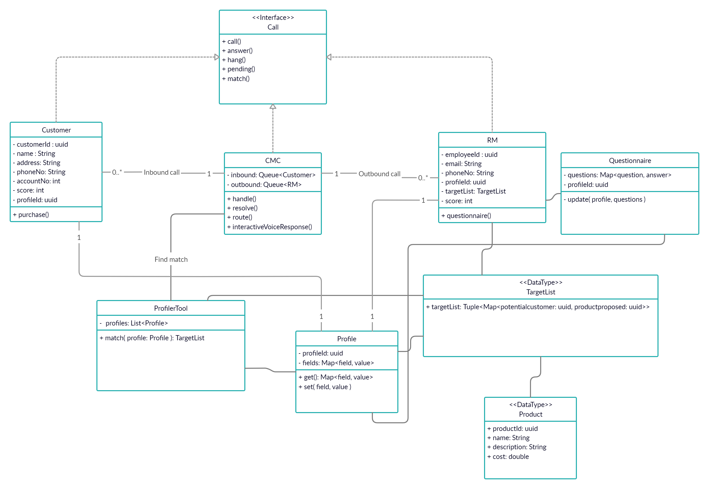
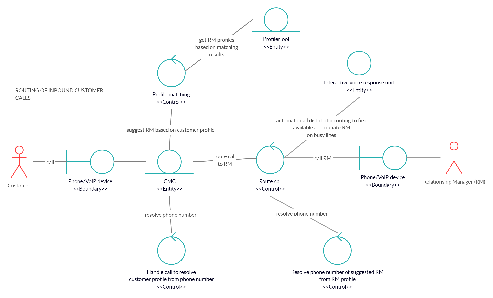
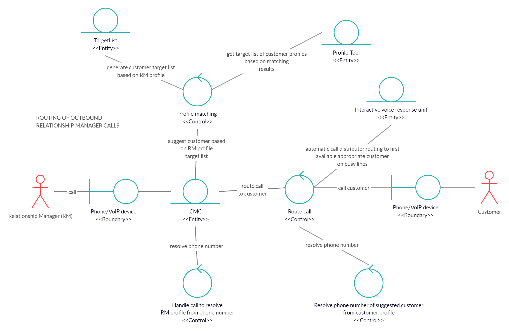

# Information System Development Methodologies - Project
Presentation Video Link: https://youtu.be/MeHik1HBFkc

## Executive Summary
The existing problem that needs to be addressed is that relationship managers (RMs) require operational assistance in the in-house call management centre to serve their end-customers based according to the RMs’ experience and customers profiles. Currently, the system operation is complicated by the varying number and nature of holiday packages offered by the travel company. Objectives of this project include creating an information system which improves the operation of the call flow rate in the CMC as well as having a new and improved system that will provide services from RMs to customers through criteria based call flow control and improved call routing. A design thinking approach will be used to achieve these objects, using modelling tools such as user stories, use case diagrams, class diagrams and collaboration diagrams. The project is also to be carried out by utilising particular scrum activities. It has been found that the existing system should adopt a more streamlined approach (such as pairing RMs with customers suitable to their level of expertise and experience) to undergo processes between the RMs and customers to achieve a greater competitive advantage over other firms in the industry. 

## Problem Definition

### Definition of the Problem
The Relationship Managers (RMs) require operational assistance in the in-house call management centre (CMC) to serve their end-customers based according to the RMs’ experience and customers profiles. Currently, the system operation is complicated by the varying number and nature of holiday packages offered by the travel company.

### Objectives
The objectives include:
* Creating an information system which improves the operation of the call flow rate in the CMC.
* Having a new and improved system that will provide services from RMs to customers through criteria based call flow control and improved call routing.
  * Criteria will be formed based on a questionnaire which will also create a ‘target list’ based on RMs’ skills and profiles. The target list would then list potential customers and suggest suitable holiday packages to be sold from RM’s.
  * The system will also match and prioritise customers to specific criteria based on details retrieved from the database. Details from the database include the customers’ likelihood to purchase the product with factors such as if they are repeat customers.
  * The information system will give a score to RM’s based on a questionnaire, with the score adjusting based on factors such as the effectiveness of serving customers and past performance to match relationship manager.
  * A script and guideline will be provided to the RMs to assist them in providing end-customer service. The outbound calls will be taken by RM’s with similar skill and cultural factors.

### List of Stakeholders
* Customers
* Airlines/Flight Companies
* Travel Agents
* Employees
* Relationship Managers
* Call Centre Workers/Manager

## Design Thinking Approach

### Reflection

#### Design Thinking Process

##### Stage 1 - Empathy
This process allowed us to view the system from the perspective of the customer and the relationship manager, giving us a better idea of what the needs and wants of the stakeholders are (see Appendix A). We noticed a general negative outlook on the time-wasting call process of the existing system.

We found that customers were not satisfied with the core process of the call management system as there were long waits with the customers being paired with less suitable relationship managers. As shown in the Point-Of-View (POV) statements (see below), customers were also more inclined to utilise online services as inbound calling resulted in longer wait times.

We also noticed that the RM’s work was less efficient with more unsuccessful sales as the managers were paired up with customers less likely to purchase the holiday packages. RM’s noticed that their competitors were able to make more sales due to their easier to use processes. From the ‘How Might We’ statements (see the below POV Statements), managers believed that having some automated voice response systems for less important tasks will help improve the call flow rate.

##### Stage 2 - Define
Through empathizing with the customers and the RM’s, we can see that the call management system needs improvement on shortening the wait times for inbound calls as well as increasing call efficiency. This will increase customer and RM satisfaction and improve the call flow rate.

### Point of View Statements

#### Customers
##### User
Customers who wish to purchase the companies holiday packages.
##### Need
To purchase holiday packages from the Relationship Managers.
##### Insight
The current situation with inbound calls prevents many suitable customers from being served due to time constraints.

#### Relationship Managers (RM)
##### User
Employees at the company who aim to make sales from inbound and outbound calls.
##### Need
To make informed calls to customers likely to produce sales and to receive calls primarily from those likely to purchase packages.
##### Insight
A more efficient system which matches manager skills with similarly skilled customers will help increase sales.

### How Might We Statements
* How might we prioritise customers likely to make a purchase
* How might we improve the call process for customers
* How might we increase the efficiency of our calls
* How might we improve the call flow rate
* How might we automate less important actions
* How might we improve the matching process between customers and relationship managers

### Reflections and Brainstormed Ideas
#### Reflections
It has been a bit difficult at first to identify how we can address the problem when taking into account the complexity and detail of the existing system that the travel company is currently using.

#### Brainstormed Ideas
* The profiling tool used in the current system will also be used to match relationship managers to customers based on their level of experience and expertise with the various packages that the travel company has to offer.
* Customers will also be prioritised based on how likely they will be likely to make a purchase from the travel company.

#### Assumptions Made
* Customers listed their information upon registering to the company
* Employees listed their information upon joining the company
* Customers’ details are stored in a database ready for retrieval
* Relationship managers’ details are stored in a centralised database ready for retrieval

### Assumptions Made
It was assumed by the team that customers and employees listed their information upon registering to the company so that the profiling system will be functional with their details stored in a database ready for retrieval.

## Workproducts, Models and Descriptions

### Use Case Diagram

### Activity Diagram

### Class Diagram

### Collaborative Diagrams

#### Inbound Calls

#### Outbound Calls

## Competitive Advatanges and Possible Effects if the project fails

### Competitive Advantages
Should the project be successful, the call flow rate of the call management centre will improve significantly. Such improvements will allow the travel company to hold a competitive advantage against competitors because of the increased efficiency of the processes that are to be carried out in the new and improved system. Increased efficiency in the system could also be linked to an increased level of customer satisfaction.

The efficiency of the processes within the new system is improved by the system prioritising customers with a higher likelihood of making a purchase. The criteria for having a higher likelihood of making a purchase is based on factors such as whether they are repeat customers for example. This makes the system more efficient as customers will be more likely to make purchases more quickly since they are prioritised, thus increasing the volume of sales for the business. It would create a competitive advantage for the company as the proportion of sales to calls would increase. 

The effectiveness of the service would be improved through the ‘profiler tool’ system which will pair up a customer with a suitable relationship manager based on certain criteria. This will allow the relationship managers to have better handling of customers they are paired with based on their expertise and understanding. It would lead to improved communication between the two parties, improving the likelihood of sales being made. This gives the company an advantage against its competitors as it is offering a tailored service to customers improving customer relations as well as increasing the company reputation.

Overall, the new and improved system will allow the travel company to have a competitive advantage against other competitors in the same industry. This is due to the projected increase in efficiency and effectiveness of the Call Management Centre’s new processes.

### Possible Effects if the project fails
If the project does not turn out to become a success, consumers could mistrust the company's profiling tool and the call management centre because of the lack of competency which the system has compared to other competitors’ systems. A high level of mistrust in the travel company could lead potential customers to be more likely to use an alternative service.

A low-quality system would be produced if the project were to fail. A low-quality service being provided to the customer may cause mistrust of the call management centre, which may hinder the reputation of the business, leading to the loss of potential business for the travel company (Pressman & Maxim 2015). Therefore, it will make customers less inclined to follow through the call management centre’s processes and complete the mandatory prerequisites required by the system, resulting in a decline of sales being made for the travel company.

Should the existing problem of the current system still exist as a result of project failure, customers are extremely likely to remain unsatisfied with the inefficiency and lack of quality service provided by relationship managers in the system. This would result in customers to most likely switch to an alternative competitor of the travel company. Losing customers is a cost for the company as there is a loss of potential ongoing revenue and reputation as a result.

Therefore, it is extremely vital that project failure does not occur in the new and improved system for the travel company as the costs could prove to be profoundly impactful on the overall health and performance of the business.

## Using GitHub to role-play agile methodologies

## References
Pressman, R.S. & Maxim, B.R. 2015, Software engineering: a practitioner's approach, 8th edn, McGraw-Hill Education, New York, NY.

## Appendix
### Appendix A - Empathy Map
